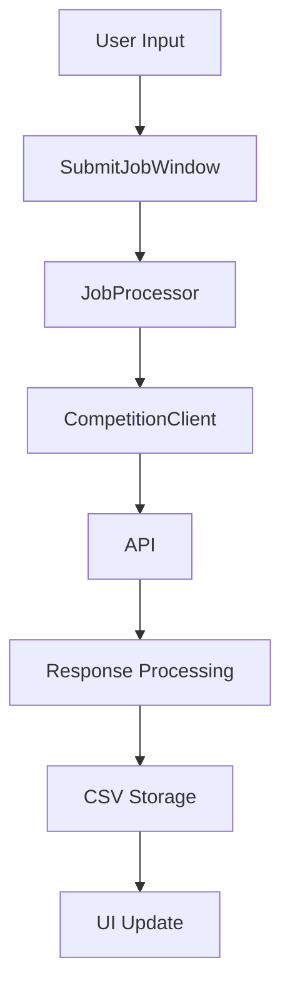
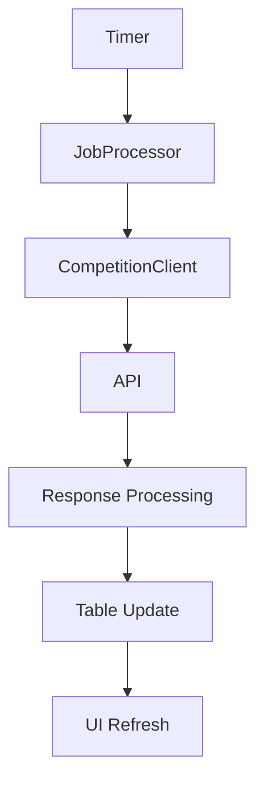

# LLMailTest Developer Documentation

[](https://github.com/psf/black)
[](https://docs.pytest.org/)
[](https://coverage.readthedocs.io/)

## Table of Contents
1. [Architecture Overview](#architecture-overview)
2. [Core Components](#core-components)
3. [Data Flow](#data-flow)
4. [API Documentation](#api-documentation)
5. [Development Guidelines](#development-guidelines)
6. [Testing Strategy](#testing-strategy)
7. [Deployment](#deployment)

## Architecture Overview

The system follows a modular architecture with clear separation of concerns:

```
Application Layer
├── GUI Interface
├── Job Management
└── Reporting

Business Logic Layer
├── Job Processing
├── Rate Limiting
└── Error Handling

Data Layer
├── Local Storage
├── API Communication
└── State Management
```

## Core Components

### Main Application (`submit_job_gui.py`)
- Entry point and main window management
- Coordinates between all components
- Handles UI initialization and updates
- Manages application state

### Job Processor (`job_processor.py`)
- Handles job submission queue
- Manages rate limiting
- Processes API responses
- Maintains job state persistence

### API Client (`submit_job.py`)
- Competition API communication
- Job submission and retrieval
- Response parsing and error handling

[Additional components...]

## Data Flow

### Job Submission


### Job Status Updates


## API Documentation

### Endpoints
- `POST /jobs`: Submit new job
- `GET /jobs/{id}`: Get job status
- `GET /jobs`: List all jobs

### Error Codes
| Code | Description |
|------|-------------|
| 400  | Bad Request |
| 429  | Rate Limited |
| 500  | Server Error |

[Detailed API specs...]

## Development Guidelines

### Setting Up
1. Clone the repository
2. Create virtual environment
3. Install dependencies:
   ```bash
   pip install -r requirements-dev.txt
   ```

### Code Style
- Follow PEP 8 guidelines
- Use type hints for all public methods
- Document all public interfaces
- Maintain 100% test coverage

### Branching Strategy
- `main`: Production-ready code
- `develop`: Integration branch
- `feature/*`: Feature development
- `bugfix/*`: Bug fixes

## Testing Strategy

### Test Types
1. **Unit Tests**: Test individual components
2. **Integration Tests**: Test component interactions
3. **End-to-End Tests**: Test complete workflows

### Running Tests
```bash
# Run all tests
pytest

# Run with coverage
pytest --cov=src

# Generate HTML report
pytest --cov-report=html
```

## Deployment

### Requirements
- Python 3.9+
- Required system dependencies

### Build Process
1. Run tests
2. Generate documentation
3. Package application

### Release Process
1. Create release branch
2. Update version number
3. Generate changelog
4. Create GitHub release
